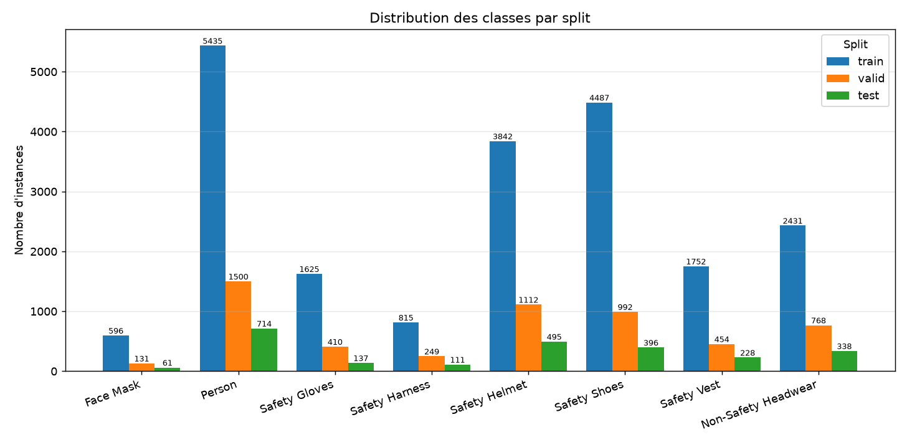
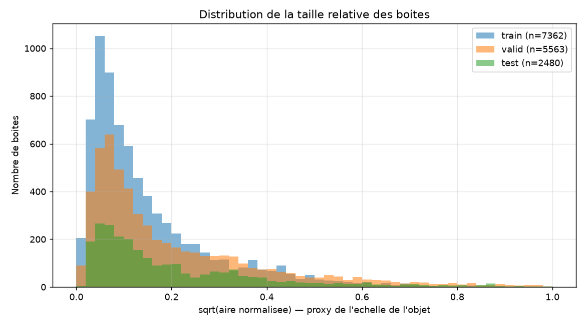
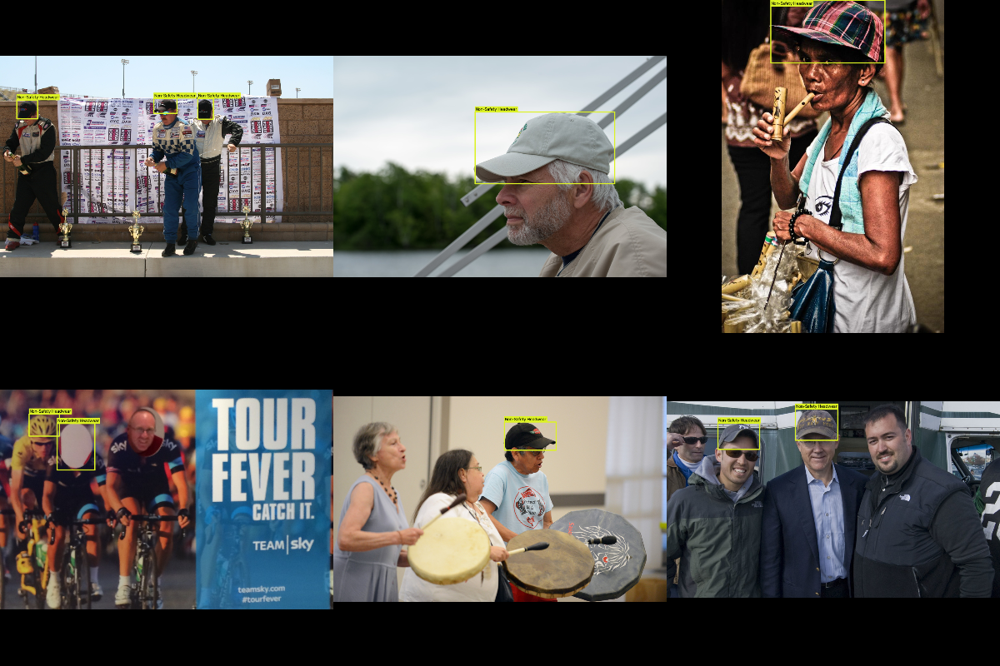

# Rapport d'audit du dataset EPI

- **Genere le** : 2026-08-07T14:43:38.010255+00:00
- **data.yaml** : `C:\Users\LENOVO LEGION\Downloads\PPE Detection Project.yolo26\artifacts\dataset_extended\data.yaml`
- **Classes (8)** : Face Mask, Person, Safety Gloves, Safety Harness, Safety Helmet, Safety Shoes, Safety Vest, Non-Safety Headwear
- **Splits trouves** : test, train, valid

> **Verdict : PRET POUR LA DETECTION** — 8204 images, 29079 annotations, 0 ligne(s) polygonale(s) a convertir, 0 erreur(s), 5 avertissement(s), 0 groupe(s) de doublons exacts.

## 1. Vue d'ensemble par split

| Split     | Images | Labels | Annot. | Detection | Polygone | Malformees | Appariement | Taille   |
|-----------|--------|--------|--------|-----------|----------|------------|-------------|----------|
| train     | 5988   | 5988   | 20983  | 20983     | 0        | 0          | oui         | 915.3 Mo |
| valid     | 1518   | 1518   | 5616   | 5616      | 0        | 0          | oui         | 236.6 Mo |
| test      | 698    | 698    | 2480   | 2480      | 0        | 0          | oui         | 114.3 Mo |
| **TOTAL** | 8204   | 8204   | 29079  | 29079     | 0        | 0          | oui         |          |

## 2. Distribution des classes

| Classe              | ID | train | valid | test | Total | Part (%) |
|---------------------|----|-------|-------|------|-------|----------|
| Face Mask           | 0  | 596   | 131   | 61   | 788   | 2.71     |
| Person              | 1  | 5435  | 1500  | 714  | 7649  | 26.30    |
| Safety Gloves       | 2  | 1625  | 410   | 137  | 2172  | 7.47     |
| Safety Harness      | 3  | 815   | 249   | 111  | 1175  | 4.04     |
| Safety Helmet       | 4  | 3842  | 1112  | 495  | 5449  | 18.74    |
| Safety Shoes        | 5  | 4487  | 992   | 396  | 5875  | 20.20    |
| Safety Vest         | 6  | 1752  | 454   | 228  | 2434  | 8.37     |
| Non-Safety Headwear | 7  | 2431  | 768   | 338  | 3537  | 12.16    |

- Classe majoritaire : **Person**
- Classe minoritaire : **Face Mask**
- Ratio max/min : **9.71**

## 3. Integrite des images

| Split | Extensions                   | Illisibles | Resolutions | Min   | Max       | Ratio L/H   |
|-------|------------------------------|------------|-------------|-------|-----------|-------------|
| train | .jpeg:8, .jpg:5876, .png:104 | 0          | 453         | 62x85 | 5184x3888 | 0.45 - 3.12 |
| valid | .jpeg:1, .jpg:1484, .png:33  | 0          | 177         | 55x87 | 5178x3884 | 0.45 - 2.68 |
| test  | .jpg:680, .png:18            | 0          | 118         | 64x82 | 2160x3840 | 0.40 - 2.15 |

## 4. Statistiques geometriques des boites

| Split | Boites | Aire min   | p05      | Mediane  | p95      | Aire max | Petits objets (<1 %) |
|-------|--------|------------|----------|----------|----------|----------|----------------------|
| train | 20983  | 4.307e-05  | 0.00128  | 0.018091 | 0.356453 | 1.0      | 38.73 %              |
| valid | 5616   | 1.157e-05  | 0.000941 | 0.017364 | 0.371011 | 0.97051  | 39.39 %              |
| test  | 2480   | 0.00015035 | 0.001173 | 0.018237 | 0.384261 | 0.984179 | 37.62 %              |

## 5. Doublons et risques de fuite

| Indicateur                                    | Valeur |
|-----------------------------------------------|--------|
| Groupes de doublons binaires exacts           | 0      |
| Fichiers en trop (doublons exacts)            | 0      |
| Groupes de doublons exacts inter-splits       | 0      |
| Hash perceptuel disponible                    | oui    |
| Clusters quasi identiques (Hamming <= 3)      | 296    |
| Images concernees                             | 2654   |
| Plus grand cluster                            | 1032   |
| Clusters s'etendant sur plusieurs splits      | 78     |
| Images dans ces clusters inter-splits         | 2134   |
| Images source Roboflow partagees entre splits | 0      |
| Fichiers concernes                            | 0      |
| Sequences numerotees reparties entre splits   | 20     |
| Images de ces sequences                       | 3593   |

> Le nombre brut de *paires* quasi identiques (56695) n'est pas un bon indicateur : un groupe de N images similaires produit N*(N-1)/2 paires. Les clusters ci-dessus refletent la realite.

Principales sequences reparties entre splits :

| Prefixe                                  | Images | Splits             |
|------------------------------------------|--------|--------------------|
| ppe-original__frame_                     | 1785   | test, train, valid |
| ppe-original__pos_                       | 582    | test, train, valid |
| ppe-original__                           | 484    | test, train, valid |
| ppe-original__image_                     | 355    | test, train, valid |
| ppe-original__S2-N2301M                  | 97     | test, train, valid |
| ppe-original__front_crawling_            | 68     | test, train, valid |
| ppe-original__ppe_                       | 68     | test, train, valid |
| ppe-original__with_mask_                 | 65     | test, train, valid |
| ppe-original__Manoj_Herness2_annotation_ | 33     | test, train, valid |
| ppe-original__img_                       | 11     | test, train, valid |

## 6. Problemes detectes

| Severite | Code                          | Description                                                                                                                                                                |
|----------|-------------------------------|----------------------------------------------------------------------------------------------------------------------------------------------------------------------------|
| AVERT.   | clamped_minor                 | [train] 293 boite(s) corrigee(s) : clamped_minor.                                                                                                                          |
| AVERT.   | clamped_minor                 | [valid] 75 boite(s) corrigee(s) : clamped_minor.                                                                                                                           |
| AVERT.   | clamped_minor                 | [test] 20 boite(s) corrigee(s) : clamped_minor.                                                                                                                            |
| AVERT.   | near_duplicates_across_splits | 78 groupe(s) d'images visuellement quasi identiques (2134 images) repartis entre plusieurs splits — les metriques de validation/test sont optimistes.                      |
| AVERT.   | video_sequences_across_splits | 20 sequence(s) d'images numerotees (3593 images de type 'frame_000324') reparties entre plusieurs splits : les frames consecutives d'une meme video sont quasi identiques. |

## 7. Detail des codes d'anomalie par split

| Code          | train | valid | test |
|---------------|-------|-------|------|
| clamped_minor | 293   | 75    | 20   |
| tiny_box      | 11    | 2     | 0    |

## 8. Graphiques et exemples

### Frequence des classes par split

### Distribution des tailles de boites

### Exemples d'annotations (verification visuelle)

## Glossaire des codes

| Code                   | Signification                                                        |
|------------------------|----------------------------------------------------------------------|
| polygon_lines          | Ligne de segmentation (class_id + paires x/y). A convertir en boite. |
| converted_from_polygon | Boite obtenue par min/max sur les sommets d'un polygone.             |
| clamped_minor          | Derive numerique <= tolerance ramenee dans [0, 1].                   |
| clipped_to_bounds      | Objet partiellement hors cadre : boite rognee sur l'image.           |
| class_id_out_of_range  | Identifiant de classe absent de data.yaml.                           |
| non_numeric            | Champ non convertible en nombre.                                     |
| non_positive_size      | Largeur ou hauteur nulle/negative.                                   |
| center_out_of_range    | Centre de la boite hors de l'image.                                  |
| bad_field_count        | Nombre de champs incompatible avec detection ou polygone.            |
| very_small_box         | Boite d'aire normalisee < 1e-5.                                      |
