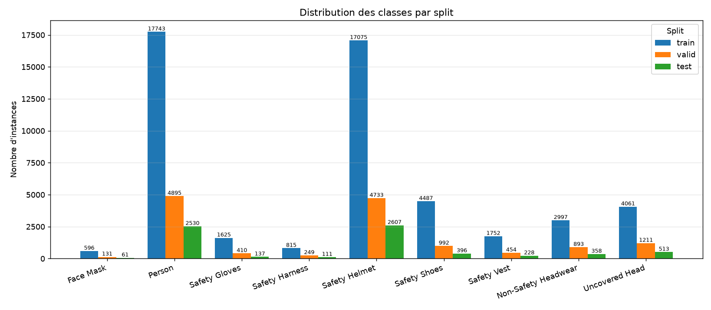
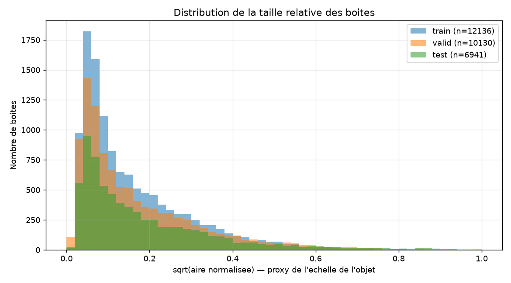
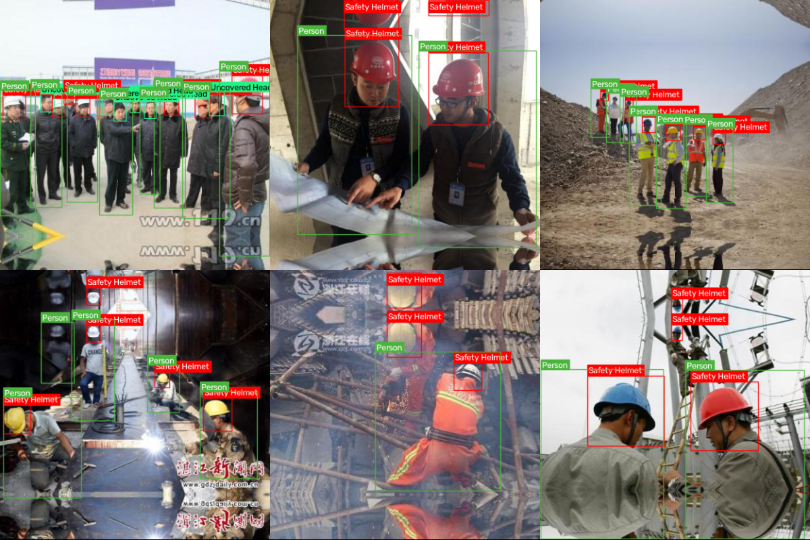

# Rapport d'audit du dataset EPI

- **Genere le** : 2026-08-17T15:11:40.201603+00:00
- **data.yaml** : `C:\Users\LENOVO LEGION\Downloads\PPE Detection Project.yolo26\artifacts\dataset_v3\data.yaml`
- **Classes (9)** : Face Mask, Person, Safety Gloves, Safety Harness, Safety Helmet, Safety Shoes, Safety Vest, Non-Safety Headwear, Uncovered Head
- **Splits trouves** : test, train, valid

> **Verdict : PRET POUR LA DETECTION** — 13853 images, 72060 annotations, 0 ligne(s) polygonale(s) a convertir, 0 erreur(s), 5 avertissement(s), 0 groupe(s) de doublons exacts.

## 1. Vue d'ensemble par split

| Split     | Images | Labels | Annot. | Detection | Polygone | Malformees | Appariement | Taille   |
|-----------|--------|--------|--------|-----------|----------|------------|-------------|----------|
| train     | 9942   | 9942   | 51151  | 51151     | 0        | 0          | oui         | 1.9 Go   |
| valid     | 2648   | 2648   | 13968  | 13968     | 0        | 0          | oui         | 526.4 Mo |
| test      | 1263   | 1263   | 6941   | 6941      | 0        | 0          | oui         | 255.4 Mo |
| **TOTAL** | 13853  | 13853  | 72060  | 72060     | 0        | 0          | oui         |          |

## 2. Distribution des classes

| Classe              | ID | train | valid | test | Total | Part (%) |
|---------------------|----|-------|-------|------|-------|----------|
| Face Mask           | 0  | 596   | 131   | 61   | 788   | 1.09     |
| Person              | 1  | 17743 | 4895  | 2530 | 25168 | 34.93    |
| Safety Gloves       | 2  | 1625  | 410   | 137  | 2172  | 3.01     |
| Safety Harness      | 3  | 815   | 249   | 111  | 1175  | 1.63     |
| Safety Helmet       | 4  | 17075 | 4733  | 2607 | 24415 | 33.88    |
| Safety Shoes        | 5  | 4487  | 992   | 396  | 5875  | 8.15     |
| Safety Vest         | 6  | 1752  | 454   | 228  | 2434  | 3.38     |
| Non-Safety Headwear | 7  | 2997  | 893   | 358  | 4248  | 5.90     |
| Uncovered Head      | 8  | 4061  | 1211  | 513  | 5785  | 8.03     |

- Classe majoritaire : **Person**
- Classe minoritaire : **Face Mask**
- Ratio max/min : **31.94**

## 3. Integrite des images

| Split | Extensions                    | Illisibles | Resolutions | Min   | Max       | Ratio L/H   |
|-------|-------------------------------|------------|-------------|-------|-----------|-------------|
| train | .jpeg:8, .jpg:6330, .png:3604 | 0          | 519         | 62x85 | 2160x3840 | 0.37 - 2.80 |
| valid | .jpeg:1, .jpg:1614, .png:1033 | 0          | 207         | 55x87 | 5178x3884 | 0.45 - 2.07 |
| test  | .jpg:745, .png:518            | 0          | 138         | 64x82 | 2160x3840 | 0.45 - 3.12 |

## 4. Statistiques geometriques des boites

| Split | Boites | Aire min   | p05      | Mediane  | p95      | Aire max | Petits objets (<1 %) |
|-------|--------|------------|----------|----------|----------|----------|----------------------|
| train | 51151  | 1.14e-06   | 0.001251 | 0.01685  | 0.294066 | 1.0      | 40.48 %              |
| valid | 13968  | 1.157e-05  | 0.001135 | 0.016247 | 0.300584 | 0.999154 | 41.1 %               |
| test  | 6941   | 0.00011136 | 0.00121  | 0.016526 | 0.293242 | 0.972784 | 40.83 %              |

## 5. Doublons et risques de fuite

| Indicateur                                    | Valeur |
|-----------------------------------------------|--------|
| Groupes de doublons binaires exacts           | 0      |
| Fichiers en trop (doublons exacts)            | 0      |
| Groupes de doublons exacts inter-splits       | 0      |
| Hash perceptuel disponible                    | oui    |
| Clusters quasi identiques (Hamming <= 3)      | 1226   |
| Images concernees                             | 4554   |
| Plus grand cluster                            | 1032   |
| Clusters s'etendant sur plusieurs splits      | 505    |
| Images dans ces clusters inter-splits         | 3018   |
| Images source Roboflow partagees entre splits | 0      |
| Fichiers concernes                            | 0      |
| Sequences numerotees reparties entre splits   | 20     |
| Images de ces sequences                       | 3593   |

> Le nombre brut de *paires* quasi identiques (57712) n'est pas un bon indicateur : un groupe de N images similaires produit N*(N-1)/2 paires. Les clusters ci-dessus refletent la realite.

Principales sequences reparties entre splits :

| Prefixe                                  | Images | Splits             |
|------------------------------------------|--------|--------------------|
| ppe-original__frame_                     | 1785   | test, train, valid |
| ppe-original__pos_                       | 582    | test, train, valid |
| ppe-original__                           | 484    | test, train, valid |
| ppe-original__image_                     | 355    | test, train, valid |
| ppe-original__S2-N2301M                  | 97     | test, train, valid |
| ppe-original__front_crawling_            | 68     | test, train, valid |
| ppe-original__ppe_                       | 68     | test, train, valid |
| ppe-original__with_mask_                 | 65     | test, train, valid |
| ppe-original__Manoj_Herness2_annotation_ | 33     | test, train, valid |
| ppe-original__img_                       | 11     | test, train, valid |

## 6. Problemes detectes

| Severite | Code                          | Description                                                                                                                                                                |
|----------|-------------------------------|----------------------------------------------------------------------------------------------------------------------------------------------------------------------------|
| AVERT.   | clamped_minor                 | [train] 1416 boite(s) corrigee(s) : clamped_minor.                                                                                                                         |
| AVERT.   | clamped_minor                 | [valid] 364 boite(s) corrigee(s) : clamped_minor.                                                                                                                          |
| AVERT.   | clamped_minor                 | [test] 193 boite(s) corrigee(s) : clamped_minor.                                                                                                                           |
| AVERT.   | near_duplicates_across_splits | 505 groupe(s) d'images visuellement quasi identiques (3018 images) repartis entre plusieurs splits — les metriques de validation/test sont optimistes.                     |
| AVERT.   | video_sequences_across_splits | 20 sequence(s) d'images numerotees (3593 images de type 'frame_000324') reparties entre plusieurs splits : les frames consecutives d'une meme video sont quasi identiques. |
| INFO     | very_small_box                | [train] 1 boite(s) tres petite(s) (aire < 1e-5).                                                                                                                           |

## 7. Detail des codes d'anomalie par split

| Code           | train | valid | test |
|----------------|-------|-------|------|
| clamped_minor  | 1416  | 364   | 193  |
| tiny_box       | 23    | 7     | 0    |
| very_small_box | 1     | 0     | 0    |

## 8. Graphiques et exemples

### Frequence des classes par split

### Distribution des tailles de boites

### Exemples d'annotations (verification visuelle)

## Glossaire des codes

| Code                   | Signification                                                        |
|------------------------|----------------------------------------------------------------------|
| polygon_lines          | Ligne de segmentation (class_id + paires x/y). A convertir en boite. |
| converted_from_polygon | Boite obtenue par min/max sur les sommets d'un polygone.             |
| clamped_minor          | Derive numerique <= tolerance ramenee dans [0, 1].                   |
| clipped_to_bounds      | Objet partiellement hors cadre : boite rognee sur l'image.           |
| class_id_out_of_range  | Identifiant de classe absent de data.yaml.                           |
| non_numeric            | Champ non convertible en nombre.                                     |
| non_positive_size      | Largeur ou hauteur nulle/negative.                                   |
| center_out_of_range    | Centre de la boite hors de l'image.                                  |
| bad_field_count        | Nombre de champs incompatible avec detection ou polygone.            |
| very_small_box         | Boite d'aire normalisee < 1e-5.                                      |
