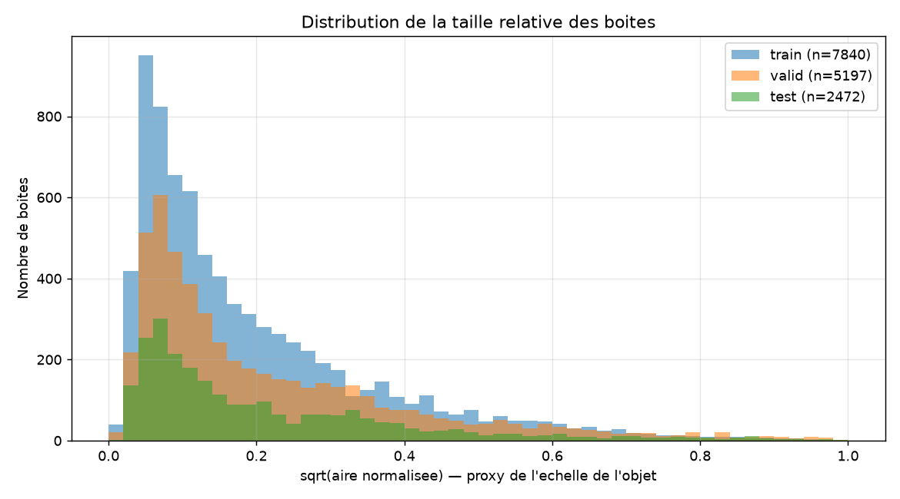
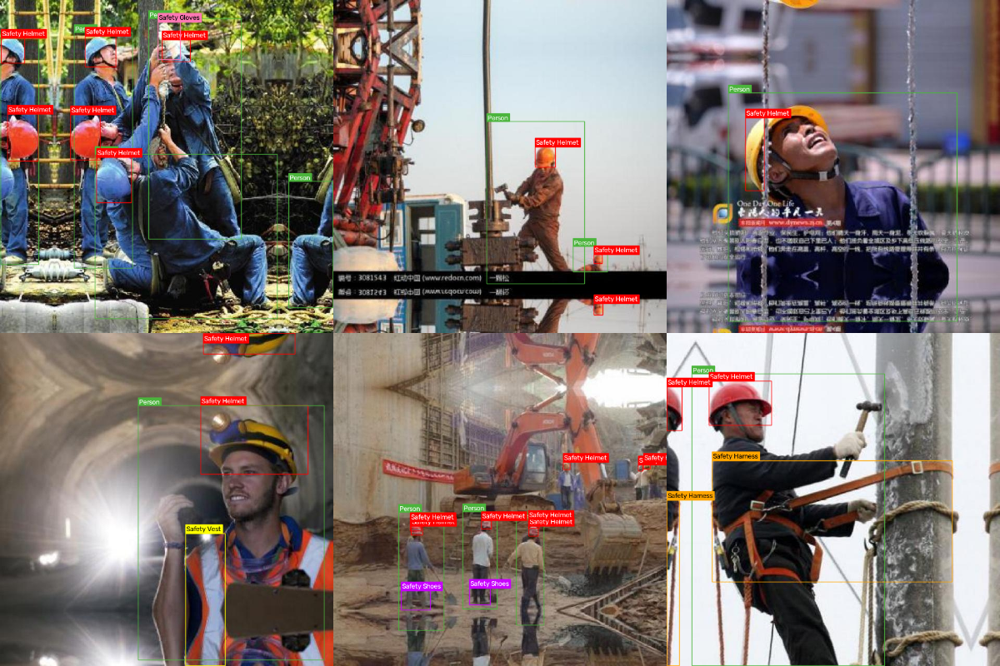

# Rapport d'audit du dataset EPI

- **Genere le** : 2026-07-30T10:43:58.270808+00:00
- **data.yaml** : `C:\Users\LENOVO LEGION\Downloads\PPE Detection Project.yolo26\data.yaml`
- **Classes (7)** : Face Mask, Person, Safety Gloves, Safety Harness, Safety Helmet, Safety Shoes, Safety Vest
- **Splits trouves** : test, train, valid

> **Verdict : CONVERSION REQUISE** — 7000 images, 25542 annotations, 349 ligne(s) polygonale(s) a convertir, 0 erreur(s), 9 avertissement(s), 0 groupe(s) de doublons exacts.

## 1. Vue d'ensemble par split

| Split     | Images | Labels | Annot. | Detection | Polygone | Malformees | Appariement | Taille   |
|-----------|--------|--------|--------|-----------|----------|------------|-------------|----------|
| train     | 4903   | 4903   | 17873  | 17588     | 285      | 0          | oui         | 606.5 Mo |
| valid     | 1399   | 1399   | 5197   | 5151      | 46       | 0          | oui         | 168.1 Mo |
| test      | 698    | 698    | 2472   | 2454      | 18       | 0          | oui         | 82.6 Mo  |
| **TOTAL** | 7000   | 7000   | 25542  | 25193     | 349      | 0          | oui         |          |

## 2. Distribution des classes

| Classe         | ID | train | valid | test | Total | Part (%) |
|----------------|----|-------|-------|------|-------|----------|
| Face Mask      | 0  | 551   | 152   | 85   | 788   | 3.09     |
| Person         | 1  | 5389  | 1536  | 724  | 7649  | 29.95    |
| Safety Gloves  | 2  | 1528  | 445   | 199  | 2172  | 8.50     |
| Safety Harness | 3  | 811   | 252   | 112  | 1175  | 4.60     |
| Safety Helmet  | 4  | 3800  | 1140  | 509  | 5449  | 21.33    |
| Safety Shoes   | 5  | 4058  | 1203  | 614  | 5875  | 23.00    |
| Safety Vest    | 6  | 1736  | 469   | 229  | 2434  | 9.53     |

- Classe majoritaire : **Person**
- Classe minoritaire : **Face Mask**
- Ratio max/min : **9.71**

## 3. Integrite des images

| Split | Extensions                   | Illisibles | Resolutions | Min   | Max       | Ratio L/H   |
|-------|------------------------------|------------|-------------|-------|-----------|-------------|
| train | .jpeg:8, .jpg:4791, .png:104 | 0          | 256         | 62x85 | 2160x3840 | 0.45 - 2.80 |
| valid | .jpeg:1, .jpg:1365, .png:33  | 0          | 103         | 55x87 | 5178x3884 | 0.45 - 2.07 |
| test  | .jpg:680, .png:18            | 0          | 71          | 64x82 | 2160x3840 | 0.45 - 2.15 |

## 4. Statistiques geometriques des boites

| Split | Boites | Aire min  | p05      | Mediane  | p95      | Aire max | Petits objets (<1 %) |
|-------|--------|-----------|----------|----------|----------|----------|----------------------|
| train | 17873  | 4.307e-05 | 0.001704 | 0.022062 | 0.375851 | 1.0      | 35.2 %               |
| valid | 5197   | 1.157e-05 | 0.001718 | 0.021503 | 0.388688 | 0.97051  | 35.04 %              |
| test  | 2472   | 0.0002611 | 0.00149  | 0.02026  | 0.387973 | 0.970368 | 36.57 %              |

## 5. Doublons et risques de fuite

| Indicateur                                    | Valeur |
|-----------------------------------------------|--------|
| Groupes de doublons binaires exacts           | 0      |
| Fichiers en trop (doublons exacts)            | 0      |
| Groupes de doublons exacts inter-splits       | 0      |
| Hash perceptuel disponible                    | oui    |
| Clusters quasi identiques (Hamming <= 3)      | 296    |
| Images concernees                             | 2654   |
| Plus grand cluster                            | 1032   |
| Clusters s'etendant sur plusieurs splits      | 173    |
| Images dans ces clusters inter-splits         | 2368   |
| Images source Roboflow partagees entre splits | 390    |
| Fichiers concernes                            | 1252   |
| Sequences numerotees reparties entre splits   | 58     |
| Images de ces sequences                       | 3241   |

> Le nombre brut de *paires* quasi identiques (56695) n'est pas un bon indicateur : un groupe de N images similaires produit N*(N-1)/2 paires. Les clusters ci-dessus refletent la realite.

Principales sequences reparties entre splits :

| Prefixe                                    | Images | Splits             |
|--------------------------------------------|--------|--------------------|
| frame_                                     | 1785   | test, train, valid |
| pos_                                       | 582    | test, train, valid |
| image_                                     | 355    | test, train, valid |
| S2-N2301M                                  | 97     | test, train, valid |
| front_crawling_                            | 68     | test, train, valid |
| ppe_                                       | 68     | test, train, valid |
| with_mask_                                 | 65     | test, train, valid |
| Manoj_Herness2_annotation_                 | 33     | test, train, valid |
| dig-pickaxe-working-street-reconstruction- | 12     | test, train, valid |
| img_                                       | 11     | test, train, valid |

## 6. Problemes detectes

| Severite | Code                          | Description                                                                                                                                                                                    |
|----------|-------------------------------|------------------------------------------------------------------------------------------------------------------------------------------------------------------------------------------------|
| AVERT.   | polygon_lines                 | [train] 285 ligne(s) de segmentation (polygone) a convertir en boite englobante pour une tache de detection.                                                                                   |
| AVERT.   | clamped_minor                 | [train] 300 boite(s) corrigee(s) : clamped_minor.                                                                                                                                              |
| AVERT.   | polygon_lines                 | [valid] 46 ligne(s) de segmentation (polygone) a convertir en boite englobante pour une tache de detection.                                                                                    |
| AVERT.   | clamped_minor                 | [valid] 111 boite(s) corrigee(s) : clamped_minor.                                                                                                                                              |
| AVERT.   | polygon_lines                 | [test] 18 ligne(s) de segmentation (polygone) a convertir en boite englobante pour une tache de detection.                                                                                     |
| AVERT.   | clamped_minor                 | [test] 46 boite(s) corrigee(s) : clamped_minor.                                                                                                                                                |
| AVERT.   | near_duplicates_across_splits | 173 groupe(s) d'images visuellement quasi identiques (2368 images) repartis entre plusieurs splits — les metriques de validation/test sont optimistes.                                         |
| AVERT.   | shared_source_images          | 390 image(s) source Roboflow (1252 fichiers) presente(s) dans plusieurs splits : meme prefixe avant '.rf.' — variantes augmentees d'une meme photo reparties entre entrainement et evaluation. |
| AVERT.   | video_sequences_across_splits | 58 sequence(s) d'images numerotees (3241 images de type 'frame_000324') reparties entre plusieurs splits : les frames consecutives d'une meme video sont quasi identiques.                     |

## 7. Detail des codes d'anomalie par split

| Code          | train | valid | test |
|---------------|-------|-------|------|
| clamped_minor | 300   | 111   | 46   |
| tiny_box      | 3     | 1     | 0    |

## 8. Graphiques et exemples

### Frequence des classes par split

### Distribution des tailles de boites

### Exemples d'annotations (verification visuelle)

## Glossaire des codes

| Code                   | Signification                                                        |
|------------------------|----------------------------------------------------------------------|
| polygon_lines          | Ligne de segmentation (class_id + paires x/y). A convertir en boite. |
| converted_from_polygon | Boite obtenue par min/max sur les sommets d'un polygone.             |
| clamped_minor          | Derive numerique <= tolerance ramenee dans [0, 1].                   |
| clipped_to_bounds      | Objet partiellement hors cadre : boite rognee sur l'image.           |
| class_id_out_of_range  | Identifiant de classe absent de data.yaml.                           |
| non_numeric            | Champ non convertible en nombre.                                     |
| non_positive_size      | Largeur ou hauteur nulle/negative.                                   |
| center_out_of_range    | Centre de la boite hors de l'image.                                  |
| bad_field_count        | Nombre de champs incompatible avec detection ou polygone.            |
| very_small_box         | Boite d'aire normalisee < 1e-5.                                      |
